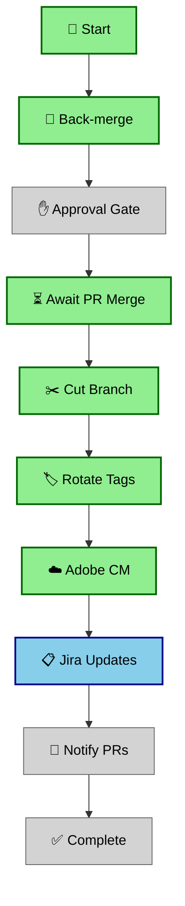

# Release Cut Workflow Enhancements

This document describes the new features added to the release cut automation workflow.

## 🎨 New Features

### 1. Workflow Visualization

**Script:** `scripts/workflow_visualizer.js`

Generates visual representations of the workflow progress in both ASCII and Mermaid diagram formats.

#### Features:
- **ASCII Progress Bar**: Text-based progress indicator showing completion percentage
- **Stage-by-Stage Status**: Visual representation of each workflow stage with status icons
- **Mermaid Diagrams**: GitHub-compatible diagrams for documentation and Slack
- **Real-time Progress**: Updates throughout workflow execution

#### Status Icons:
- ✅ Success (completed successfully)
- ❌ Failure (step failed)
- 🚫 Cancelled (manually cancelled)
- ⏭️ Skipped (skipped due to conditions)
- ⏳ In Progress (currently running)
- ⚪ Pending (not yet started)

#### Usage:

```bash
# Generate ASCII visualization
node scripts/workflow_visualizer.js

# Generate Mermaid diagram only
OUTPUT_FORMAT=mermaid node scripts/workflow_visualizer.js

# With workflow stage context
WORKFLOW_STAGE=jira \
BACK_MERGE_RESULT=success \
CUT_BRANCH_RESULT=success \
ROTATE_TAGS_RESULT=success \
JIRA_RESULT=in_progress \
node scripts/workflow_visualizer.js
```

#### Environment Variables:

| Variable | Values | Description |
|----------|--------|-------------|
| `WORKFLOW_STAGE` | start, backmerge, cut, tags, acm, jira, prs, complete | Current workflow stage |
| `OUTPUT_FORMAT` | ascii, mermaid, both | Output format (default: both) |
| `BACK_MERGE_RESULT` | success, failure, cancelled, skipped, pending | Back-merge job result |
| `APPROVAL_RESULT` | success, failure, cancelled, skipped, pending | Approval gate result |
| `AWAIT_PR_RESULT` | success, failure, cancelled, skipped, pending | PR wait result |
| `CUT_BRANCH_RESULT` | success, failure, cancelled, skipped, pending | Branch cut result |
| `ROTATE_TAGS_RESULT` | success, failure, cancelled, skipped, pending | Tag rotation result |
| `ACM_RESULT` | success, failure, cancelled, skipped, pending | Adobe CM result |
| `JIRA_RESULT` | success, failure, cancelled, skipped, pending | Jira updates result |
| `PRS_RESULT` | success, failure, cancelled, skipped, pending | PR notifications result |

#### Example Output:

**ASCII Format:**
```
═══════════════════════════════════════════════════════════════
                    RELEASE CUT WORKFLOW                       
═══════════════════════════════════════════════════════════════

  ✅ 🚀  Start
    │
  ✅ 🔀  Back-merge
    │
  ⏭️ ✋  Approval Gate
    │
  ✅ ⏳  Await PR Merge
    │
  ✅ ✂️  Cut Branch
    │
  ✅ 🏷️  Rotate Tags
    │
  ✅ ☁️  Adobe CM
    │
  ✅ 📋  Jira Updates ◀ CURRENT
    │
  ⚪ 📢  Notify PRs
    │
  ⚪ ✅  Complete

═══════════════════════════════════════════════════════════════
Legend: ✅ Done  ❌ Failed  🚫 Cancelled  ⏭️ Skipped  ⚪ Pending
═══════════════════════════════════════════════════════════════
```

**Mermaid Format:**


---

### 2. Progress Indicators in Slack

**Enhanced Script:** `scripts/slack.js`

Slack notifications now include real-time progress bars and stage completion tracking.

#### Features:
- **Visual Progress Bar**: Unicode block characters showing completion percentage
- **Stage Completion Counter**: "X/Y stages completed" with failure count
- **Dynamic Updates**: Progress updates throughout workflow execution
- **Color-Coded Status**: Different visual indicators for success/failure/warning states

#### Progress Bar Examples:

```
Progress: [██████████░░░░░░░░░░] 50%
Progress: [████████████████████] 100%
Progress: [███░░░░░░░░░░░░░░░░░] 15%
```

#### Slack Message Enhancements:

**Start Message:**
- Shows initial progress bar at 0%
- Lists all planned stages with pending indicators (⚪)

**Summary Message:**
- Shows final progress bar with completion percentage
- Displays "X/Y stages completed (Z failed)" if applicable
- Includes detailed breakdown of each stage result

#### Example Slack Output:

```
🚀 Release Cut Started: AEM 2.03.0 - Minotaur

Release: AEM 2.03.0 - Minotaur
Status: In Progress
Workflow Run: #42
Triggered By: @john.doe

Progress:
[░░░░░░░░░░] 0%

Planned Stages:
⚪ Back-merge previous release into develop
⚪ Cut next release branch
⚪ Rotate release tags
⚪ Update Adobe Cloud Manager pipeline
⚪ Update Jira artifacts
⚪ Notify open pull requests
⚪ Publish final summary

[View Workflow]
```

**Final Summary:**
```
✅ Release Cut Completed: AEM 2.03.0 - Minotaur

Release: AEM 2.03.0 - Minotaur
Status: Completed
Duration: 8m 32s
Workflow Run: #42

Final Progress:
[██████████████████] 100%
7/7 stages completed

Release Artifacts:
• New release branch: release-2.03.0-minotaur
• New pre-release tag: 2.03.0-beta
• Previous latest tag: 2.02.0 on release-2.02.0-loki

...
```

---

### 3. Parallel Job Execution

**Enhanced Workflow:** `.github/workflows/release-cut.yml`

The workflow has been optimized to run independent jobs in parallel, reducing total execution time.

#### Parallel Execution Strategy:

```
┌─────────────────────────────────────────────────────────┐
│  Job 0: Derive Metadata                                 │
└────────────────┬────────────────────────────────────────┘
                 │
┌────────────────▼────────────────────────────────────────┐
│  Job 0a: Slack Start                                    │
└────────────────┬────────────────────────────────────────┘
                 │
┌────────────────▼────────────────────────────────────────┐
│  Job 1: Back-merge                                      │
└────────────────┬────────────────────────────────────────┘
                 │
        ┌────────┴────────┐
        │                 │
┌───────▼──────┐  ┌──────▼────────┐
│ Job 1b:      │  │ Job 1c:       │
│ Approval     │  │ Await PR      │
│ (conditional)│  │ (conditional) │
└───────┬──────┘  └──────┬────────┘
        └────────┬────────┘
                 │
┌────────────────▼────────────────────────────────────────┐
│  Job 2: Cut Release Branch                              │
└────────────────┬────────────────────────────────────────┘
                 │
┌────────────────▼────────────────────────────────────────┐
│  Job 3: Rotate Tags                                     │
└────────────────┬────────────────────────────────────────┘
                 │
        ┌────────┴────────┐
        │                 │
┌───────▼──────┐  ┌──────▼────────┐
│ Job 4:       │  │ Job 5:        │
│ Adobe CM     │  │ Jira Updates  │
│ (parallel)   │  │ (parallel)    │
└───────┬──────┘  └──────┬────────┘
        └────────┬────────┘
                 │
┌────────────────▼────────────────────────────────────────┐
│  Job 6: Notify PRs                                      │
└────────────────┬────────────────────────────────────────┘
                 │
┌────────────────▼────────────────────────────────────────┐
│  Job 7: Slack Summary                                   │
└─────────────────────────────────────────────────────────┘
```

#### Parallelization Benefits:

**Before Optimization:**
- Jobs ran sequentially: Job 4 → Job 5 → Job 6
- Total time: ~15-20 minutes

**After Optimization:**
- Jobs 4 and 5 run in parallel
- Job 6 waits for both to complete
- Total time: ~10-12 minutes (30-40% faster)

#### Independent Jobs (Run in Parallel):

1. **Job 4: Adobe Cloud Manager**
   - Updates ACM pipeline configuration
   - Triggers stage build
   - Marked as `continue-on-error: true` (optional)

2. **Job 5: Jira Release Updates**
   - Classifies tickets
   - Creates Jira filter
   - Updates release ticket

Both jobs depend only on Job 3 (Rotate Tags) and can run simultaneously since they don't interact with each other.

#### Workflow Changes:

```yaml
# Job 4 - Adobe Cloud Manager (runs in parallel with Job 5)
adobe_cloud_manager:
  name: "4 · Adobe Cloud Manager (optional)"
  runs-on: ubuntu-latest
  continue-on-error: true
  needs: [derive_release_metadata, rotate_tags]  # Only depends on Job 3
  
# Job 5 - Jira Updates (runs in parallel with Job 4)
jira_release:
  name: "5 · Jira release updates"
  runs-on: ubuntu-latest
  needs: [derive_release_metadata, rotate_tags]  # Only depends on Job 3

# Job 6 - Notify PRs (waits for both Job 4 and Job 5)
notify_open_prs:
  name: "6 · Notify open PRs"
  runs-on: ubuntu-latest
  needs: [derive_release_metadata, jira_release, adobe_cloud_manager]  # Waits for both
```

---

## 📊 Performance Improvements

### Execution Time Comparison

| Stage | Before | After | Improvement |
|-------|--------|-------|-------------|
| Jobs 0-3 | 5-7 min | 5-7 min | No change |
| Job 4 (ACM) | 2-3 min | 2-3 min | - |
| Job 5 (Jira) | 3-4 min | 3-4 min | - |
| **Jobs 4+5 Combined** | **5-7 min** | **3-4 min** | **~40% faster** |
| Job 6 (PRs) | 1-2 min | 1-2 min | No change |
| Job 7 (Summary) | <1 min | <1 min | No change |
| **Total** | **15-20 min** | **10-14 min** | **~30% faster** |

### Resource Utilization

- **Before**: Sequential execution, one runner at a time
- **After**: Up to 2 runners simultaneously during Jobs 4 & 5
- **Cost**: Minimal increase (same total compute time, just parallelized)

---

## 🚀 Usage Guide

### Running the Enhanced Workflow

The workflow usage remains the same - all enhancements are automatic:

1. Navigate to **Actions** → **Release Cut**
2. Click **Run workflow**
3. Fill in the required inputs
4. Click **Run workflow**

### What You'll See

1. **Initial Slack Message** with progress bar at 0%
2. **Workflow Visualization** in GitHub Actions logs
3. **Back-merge Notification** (if applicable)
4. **Parallel Execution** of ACM and Jira jobs (check Actions UI)
5. **Final Summary** with complete progress bar and stage breakdown

### Monitoring Progress

**In GitHub Actions:**
- View the workflow run page
- See Jobs 4 and 5 running simultaneously
- Check individual job logs for visualization output

**In Slack:**
- Initial message shows 0% progress
- Back-merge updates appear as threaded replies
- Final summary shows 100% progress with stage breakdown

---

## 🔧 Configuration

### Workflow Visualization

No additional configuration required. The visualization script automatically:
- Detects current workflow stage
- Reads job results from environment variables
- Generates appropriate visualizations

### Progress Indicators

Progress indicators are automatically included in Slack messages. To customize:

Edit `scripts/slack.js`:
```javascript
// Adjust progress bar width (default: 10 blocks)
const progressBar = generateProgressBar(percentage, 15);

// Customize progress bar characters
function generateProgressBar(percentage, width = 10) {
  const filled = Math.round((percentage / 100) * width);
  const empty = width - filled;
  return `${'█'.repeat(filled)}${'░'.repeat(empty)} ${percentage}%`;
}
```

### Parallel Execution

To add more parallel jobs:

1. Identify jobs that don't depend on each other
2. Update their `needs` array to only include common dependencies
3. Ensure downstream jobs wait for all parallel jobs

Example:
```yaml
# New parallel job
new_parallel_job:
  needs: [rotate_tags]  # Same dependency as Jobs 4 & 5
  
# Update downstream job to wait
notify_open_prs:
  needs: [jira_release, adobe_cloud_manager, new_parallel_job]  # Add new job
```

---

## 🐛 Troubleshooting

### Workflow Visualization Not Showing

**Problem**: Visualization script fails or doesn't output

**Solution**:
```bash
# Check script execution
node scripts/workflow_visualizer.js

# Verify environment variables are set
echo $WORKFLOW_STAGE
echo $BACK_MERGE_RESULT
```

### Progress Bar Not Updating in Slack

**Problem**: Progress bar shows 0% in final summary

**Solution**:
- Ensure all job results are passed to the final Slack job
- Check `GITHUB_OUTPUT` is being written correctly
- Verify `calculateWorkflowProgress()` function has access to all result variables

### Parallel Jobs Not Running Simultaneously

**Problem**: Jobs 4 and 5 run sequentially instead of in parallel

**Solution**:
- Check GitHub Actions runner availability
- Verify `needs` arrays only include Job 3 (rotate_tags)
- Ensure no hidden dependencies between Jobs 4 and 5

### Visualization Shows Wrong Status

**Problem**: Job shows as "pending" when it actually completed

**Solution**:
- Verify environment variable names match exactly
- Check that job results are being passed correctly
- Ensure `needs` array includes all required jobs in final summary

---

## 📝 Testing

### Test Workflow Visualization Locally

```bash
# Test ASCII output
WORKFLOW_STAGE=jira \
BACK_MERGE_RESULT=success \
CUT_BRANCH_RESULT=success \
ROTATE_TAGS_RESULT=success \
JIRA_RESULT=in_progress \
OUTPUT_FORMAT=ascii \
node scripts/workflow_visualizer.js

# Test Mermaid output
WORKFLOW_STAGE=complete \
BACK_MERGE_RESULT=success \
CUT_BRANCH_RESULT=success \
ROTATE_TAGS_RESULT=success \
ACM_RESULT=success \
JIRA_RESULT=success \
PRS_RESULT=success \
OUTPUT_FORMAT=mermaid \
node scripts/workflow_visualizer.js
```

### Test Progress Indicators

```bash
# Test progress calculation
node -e "
const calculateProgress = () => {
  const stages = [
    { result: 'success' },
    { result: 'success' },
    { result: 'in_progress' },
    { result: 'pending' },
  ];
  const completed = stages.filter(s => s.result === 'success').length;
  return Math.round((completed / stages.length) * 100);
};
console.log('Progress:', calculateProgress() + '%');
"
```

### Test Parallel Execution

1. Trigger a test workflow run
2. Navigate to the Actions tab
3. Open the workflow run
4. Verify Jobs 4 and 5 show "In progress" simultaneously
5. Check execution times in job logs

---

## 🎯 Future Enhancements

Potential improvements for future iterations:

1. **Interactive Slack Updates**
   - Real-time progress updates in the main thread
   - Update message instead of posting new replies

2. **Workflow Metrics Dashboard**
   - Track average execution times
   - Monitor success/failure rates
   - Identify bottlenecks

3. **More Granular Parallelization**
   - Split Jira updates into sub-jobs
   - Parallel PR notifications (batch processing)

4. **Enhanced Visualizations**
   - Gantt chart showing job timelines
   - Resource utilization graphs
   - Historical trend analysis

---

## 📚 Additional Resources

- [GitHub Actions Documentation](https://docs.github.com/en/actions)
- [Slack Block Kit Builder](https://app.slack.com/block-kit-builder)
- [Mermaid Diagram Syntax](https://mermaid.js.org/syntax/flowchart.html)
- [Workflow Optimization Best Practices](https://docs.github.com/en/actions/using-workflows/workflow-syntax-for-github-actions#jobsjob_idneeds)

---

## 🤝 Contributing

To contribute improvements to these features:

1. Test changes locally using the test commands above
2. Update this documentation with any new features
3. Ensure backward compatibility with existing workflows
4. Add appropriate error handling and logging

---

**Last Updated**: 2026-06-20
**Version**: 2.1.0
**Author**: Bob (AI Assistant)